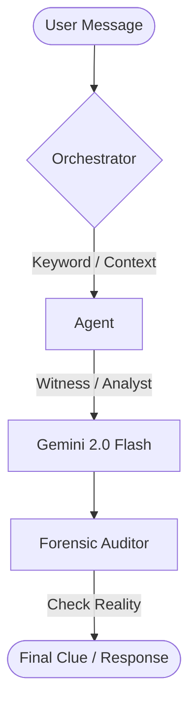

# CSI Vegas 🎰🔍

A sophisticated **High-Efficiency Multi-Agent AI** murder mystery game set in Las Vegas. Interrogate suspects with persona-driven dialogue, analyze forensic evidence via Agent Reyes, and detect lies through real-time forensic auditing.

---

## 🎯 **System Architecture: High-Efficiency Noir**

The project has been optimized for **speed**, **reasoning depth**, and **zero-dependency logic**. By removing legacy RAG (Vector DB) layers, the system now provides near-instantaneous multi-agent coordination powered by **Gemini 2.0 Flash**.

### **🤖 Specialized Agents**
- **🕵️ Witness Agent**: Interactive suspect interrogation with personality-driven defensive behavior.
- **🔬 Analyst Agent (Reyes)**: Grizzled forensic expert. Provides scientific evidence processing and importance grading.
- **🎙️ Narrator Agent**: Atmospheric cynic. Manages case updates with neon-drenched noir storytelling.
- **🔍 Forensic Auditor**: Real-time contradiction detection. Compares witness statements against ground truth secrets.

---

## 🏗️ **Core Logic Flow**

---

## 🎮 **Gameplay Features**

- **[! ] Contradiction Alerts**: The "View Analysis" button highlights discrepancies if a suspect lies about their alibi or motive.
- **🔍 Forensic Diagnostics**: Every agent response includes a "Thinking Trace" showing the internal logic and evidence cross-referencing.
- **📋 Automatic Prefixing**: Selecting a suspect in the log automatically prepares your question field (e.g., `[Lola Luxe]: `) to keep the pressure on.
- **⚡ Ultra-Low Latency**: Optimized keyword-based intent classification ensures sub-second routing to the correct expert.

---

## 🛠️ **Technical Implementation**

| Category | Technology | Description |
| :--- | :--- | :--- |
| **LLM Engine** | **Gemini 2.0 Flash** | High-speed, high-reasoning inference via Native REST API. |
| **Orchestration** | **Heuristic Multi-Agent** | Keyword-driven intent routing for zero-latency agent selection. |
| **Audit Layer** | **Forensic Truth Engine** | Real-time validation of suspect responses against immutable case secrets. |
| **Frontend** | **React + Vite** | Premium noir UI featuring metallic gold gradients and rounded "manila folder" dossier cards. |
| **Typography** | **Lexend & Outfit** | Modern, readable fonts with a bureaucratic-noir aesthetic. |

---

## 🚀 **Getting Started**

### **Backend Setup**
1. **API Key**: Set `GEMINI_API_KEY` in `backend/.env`.
2. **Install**: `pip install -r requirements.txt` (Now lightweight: FastAPI, Pydantic, Dotenv).
3. **Run**: `uvicorn main:app --reload --port 8000`

### **Frontend Setup**
1. **Install**: `npm install`
2. **Run**: `npm run dev` → `http://localhost:5173`

---

## 🏁 **How to Play**

1. **Initiate Investigation**: Click the start button — a unique Vegas murder mystery is generated instantly.
2. **Review Dossier**: Check suspect traits, motives, and the victim's profile in the left panels.
3. **Interrogate**: Use the Log to question suspects. **Tip**: Use keywords like "alibi" or "motive".
4. **Analyze**: Submit evidence to Agent Reyes using keywords like "sweep", "DNA", or "fingerprint".
5. **Accuse**: Once you've caught the culprit in a contradiction and found the key clue, reveal the secret and make your move.

---

**CSI Vegas** - Built for hackers, detectives, and those who know that the house always wins. 🎰🔍
